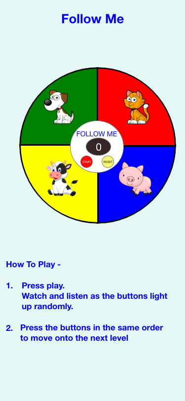

# Follow Me Game

The focus of this project is to create a memory game for children to play. My aim is to build this game using the skills learnt using HTML, CSS, JavaScript and jQuery.

## UX

This website is a memory game aimed at children to play on all mobile and desktop devices.

### User Stories:

The user plays this game to test their memory. They must follow a sequence in the correct order to progress to the next level. The level of difficulty increases as the user gets the sequence correct.

### UX Design: 

Below is the link for the wireframes I used during the project using Adobe XD

https://xd.adobe.com/view/435d155a-7097-4ba7-7aa7-d3c61a691028-356c/

Whilst programming the first wireframe I realised that it was not very appealing so I changed my design to the second wireframe.

## Features

The start button starts the sequence of the game, starting level one with just one pad to be pressed. As the user gets the correct sequence another pad is included in the sequence increasing the difficulty of the level. Each pad has a picture of an animal and as the pad is activated the sound of that animal is played. I have included a reset button to the centre of the board so the game and levels can be reset. 

### Existing features

There are six levels which need to be replecated correctly for the user to win.

### Feature Left to Implement

More levels can be added if required at a later date or even a timed game with a high score.

## Technologies Used

Throughout this project I have used:

• HTML5 to build the content of the website 
• CSS to sytle my HTML 
• JavaScript to program the functionality of the board 
• jQuery library from https://jquery.com to simplify DOM manipulation

## Testing

I have tested the functionality of my code on 
• Chrome 
• Safari 
• Firefox 
• Opera 
• Mobile browsers, including Galaxy S5, Kindle Fire HDX, Laptop, Nexus 10, iPhone 4, iPhone 6, iPhone X, iPad and iPad Pro

As the game is played on each media the images and game board increases or decreases respectively.

I validated html my code using https://validator.w3.org and corrected any errors such as image alt tags.

I passed my JavaScript through a linter, www.jshint.com to check there are no major issues.

I believe that all of the user goals have been acheived.

## Deployment

I have used cloud 9 to work on the coding of the website at https://c9.io/sgriggs177/follow-me-game
The website is deployed on GitHub at https://sarahg177.github.io/follow_me_game/

## Credits

### Media

The sounds I have used throughout the games are downloaded from www.soundbible.com. The pictures used are downloaded from www.clipart.info (cat), www.clipart-library.com (dog),
www.clipartmax.com (cow), www.dlpng.com (pig).

### Acknowledgements
    
I received inspiration for this website mainly from the orginal SIMON game.